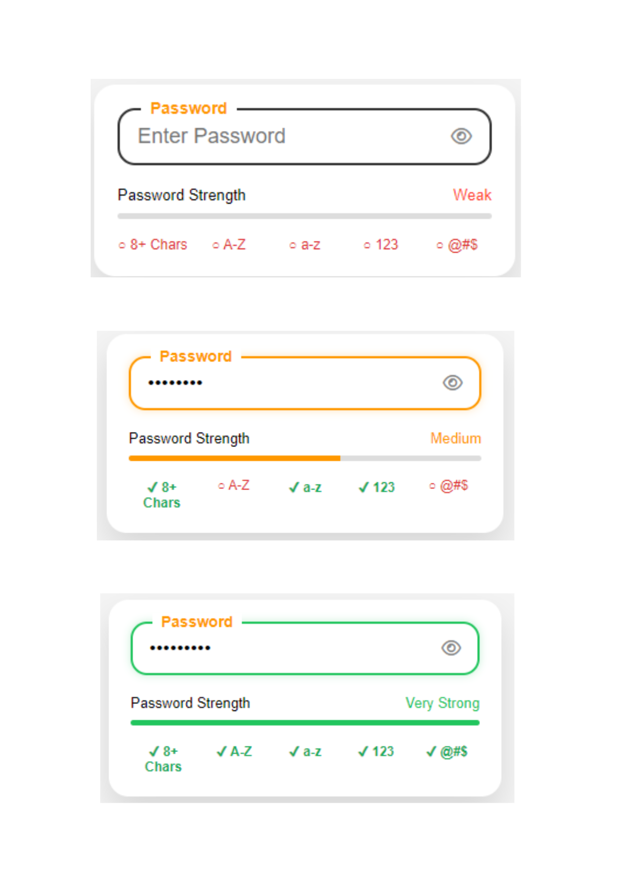

# 🔐 Premium Password Strength UI

A modern and responsive **Password Strength Checker** built using **pure HTML, CSS, and JavaScript**. This project provides real-time password validation with a clean UI, animated strength indicator, and live feedback to help users create secure passwords.

## ✨ Features

- 🔒 Live Password Strength Indicator
- 📊 Animated Progress Bar
- 👁️ Show / Hide Password Toggle
- ✅ Real-time Password Validation
- 🎨 Dynamic Border Colors
  - ⚫ Black (Default)
  - 🟠 Orange (While Typing)
  - 🟢 Green (All Conditions Met)
- 📱 Responsive Design
- 📄 Single HTML File
- 🚀 No Frameworks or Dependencies
- 👨‍💻 Beginner Friendly

## 📸 Preview



## 🚀 Getting Started

No installation or setup required.

1. Download or clone this repository.
2. Open the `password.html` file in any modern web browser.

That's it! 🎉

## 🔑 Password Rules

The password is considered **Very Strong** when it satisfies all of the following:

- ✅ At least **8 characters**
- ✅ Contains an **uppercase letter (A–Z)**
- ✅ Contains a **lowercase letter (a–z)**
- ✅ Contains a **number (0–9)**
- ✅ Contains a **special character (@#$%&*! etc.)**

## 🛠️ Built With

- HTML5
- CSS3
- JavaScript (Vanilla JS)

## 📂 Project Structure

```text
Premium-Password-UI/
│
├── password.html
├── README.md
├── LICENSE
└── preview.png
```

## 🌟 Future Improvements

- Smooth UI animations
- Dark Mode
- Customizable password rules
- Copy Password button
- Password Generator
- Accessibility enhancements

## 📄 License

This project is licensed under the **MIT License**.

Feel free to use, modify, and share this project for personal or commercial purposes.
